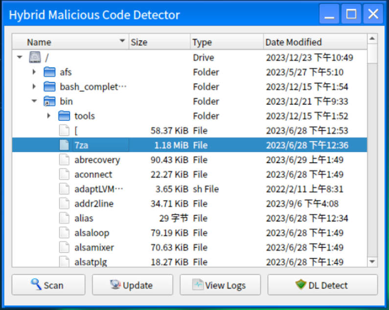

# ClamGuard

ClamGuard 是一个集成了ClamAV的扫描恶意代码功能和基于深度学习的恶意代码检测功能，其中深度学习检测使用二进制代码灰度图像化方法在AlexNet模型上进行检测，能够覆盖源代码和二进制可执行程序的检测。本项目可以运行在OpenEuler系统上，也可以运行在其他Linux系统中。



## Requirements
- 操作系统 Linux
- python == 3.10
- pytorch == 2.1.0
- PyQt5 == 5.15.10

### Usage

- 安装clamav，根据官网的说明进行配置，确保系统能够正常运行ClamAV

- 终端执行以下命令以启动软件
```bash
python3 ClamGuard.py
```
